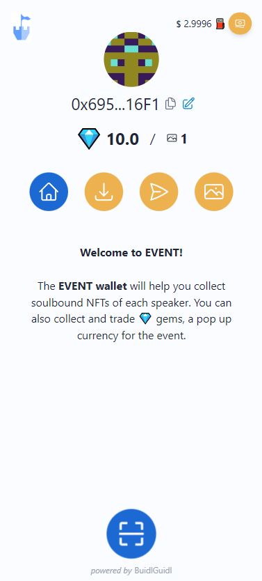
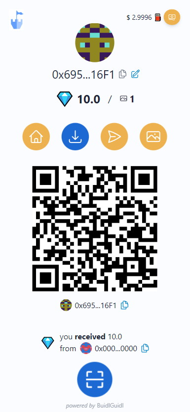
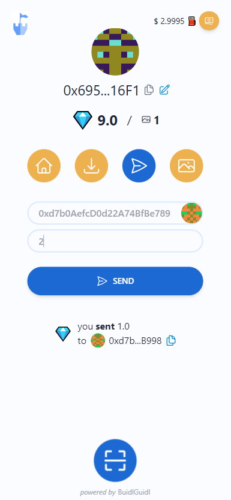
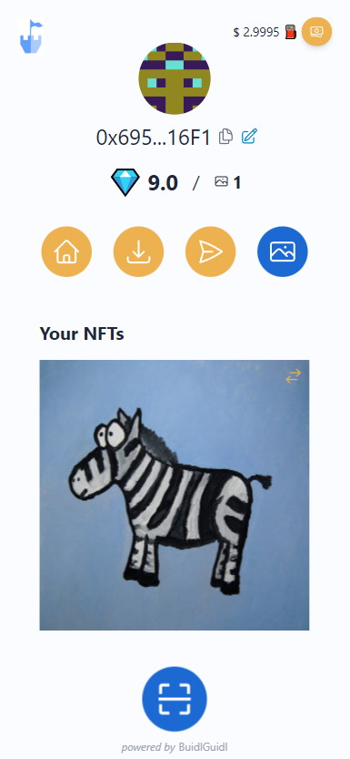
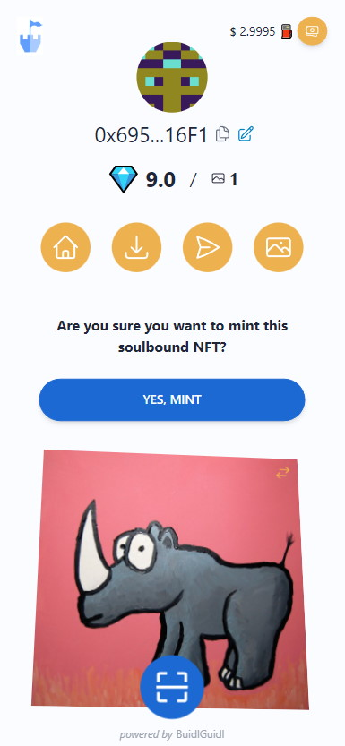
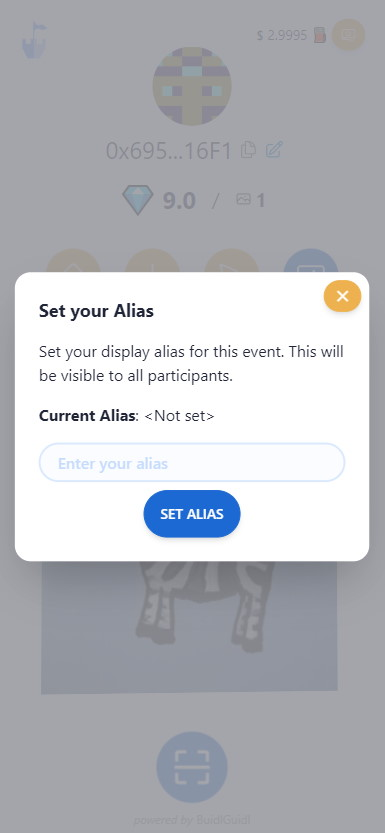

# Event Wallet

This **forkable** project provides a web-based crypto (burner) wallet, aiming to enhance the experience of attendees at your event, by providing a gamification element. This allows interaction with other attendees, as well as the organizers and sponsors of the event.

**Event Wallet** is designed for both crypto natives and newcomers to complete a series of activities, allowing them to have a more immersive experience within your crypto event, experimenting with common use-cases of the crypto space, like sending / receiving tokens, and minting NFTs.

## Event Wallet features

### For attendees

- Get a welcome message with the Event and wallet instructions.
- Scan QR codes to mint soulbound NFTs (of each speaker for example).
- Receive 💎 gem tokens when they complete different tasks (like mint an NFT).
- Exchange 💎 gem tokens with other attendees, or use them to purchase swag or food during the event.
- Set an alias linked to the wallet address.

### For organizers

- Mass generate wallets for your attendees.
- Generate QR codes linked to each wallet to include them in your attendees' tickets.
  - **Note**: You can also give attendees a link to their wallet (/ticket#SECRET_FOR_EACH_USER). e.g. in the email where they get the ticket for the event.
- Airdrop 💎 gem tokens and gas to the attendees.
- Set VIP status on the contract to offer special experiences to VIP attendees.
- Easily create customized NFTs and upload them to IPFS.
- Export Leaderboard to get the list of prize winners.

## Wallet overview

Let's take a quick tour around the Event Wallet to check the actions that attendees can perform with it, after scanning the QR from their tickets, which gives them access to their personal wallet.

- **Welcome screen - Home**  
  When users access their wallet, the first thing they see is a welcome message and some brief instructions on what they will be able to do with their wallet during the event.

  

- **Receive tokens**  
  At this screen, attendees get a QR code to show to other users for easier token transfers. When another wallet user scans this QR code, a transfer preloads with the QR address as the recipient of the transfer.

  They can also review all the token transfers received so far.

  

- **Send tokens**  
  Here you can make token transfers to others wallet. You can manually input the address and the amount of tokens you want to send, or you can scan another attendee's or merchant QR to preload their address.

  You can also review the history of transfers you have sent.

  

- **Collectibles**  
  In the collectibles section, you'll find all the NFTs you've minted during the event.

  To mint an NFT, you simply need to scan the QR code of a collectible, and it will display the minting screen.

  

- **Scan QRs**  
  At the bottom of the wallet, you'll find the button to scan QR codes. You can scan three types of QR codes:

  - **Wallet access**. Will load the wallet linked to the QR, located at your Event Ticket.
  - **Send to**. Loads the Send screen with a preloaded "To" address. You'll have to scan this QR from another wallet or from a swag stand.
  - **Mint collectible**. It loads Mint screen for the soulbound collectible linked to the QR. You'll find those during the speaks.

  

- **Set alias**  
  Set up an alias associated to your wallet address. It will be shown at your wallet profile and at the Leaderboard.

  

Here you can view some Events that used our wallet:

| Event      | Links                                                                                               | Description                                   |
| ---------- | --------------------------------------------------------------------------------------------------- | --------------------------------------------- |
| Edcon 2023 | [Repo](https://github.com/BuidlGuidl/event-wallet/tree/edcon-2023) / [Site](https://2023.edcon.io/) | First event that used BuidlGuidl Event Wallet |

## Steps to set your own Event Wallet

You'll need to complete a few steps to have your Event Wallet running:

- [0. Checking prerequisites](#0-checking-prerequisites)
- [1. Clone/Fork this repo & install dependencies](#1-clonefork-this-repo--install-dependencies)
- [2. Configure on-chain data for your Event Wallet](#2-configure-on-chain-data-for-your-event-wallet)
  - [2.1 Set Token details](#21-set-token-details)
  - [2.2 Set Up Wallets](#22-set-up-wallets)
  - [2.3 Generate NFTs](#23-generate-nfts)
- [3. Configure website](#3-configure-website)
- [4. Testing locally](#4-testing-locally)
- [5. Deploy to a Live Network](#5-deploy-to-a-live-network)
  - [5.1 Deploy your Smart Contracts](#51-deploy-your-smart-contracts)
  - [5.2 Deploy your NextJS App](#52-deploy-your-nextjs-app)
  - [5.3 Disabling type and linting error checks](#53-disabling-type-and-linting-error-checks)

### 0. Checking prerequisites

This project is powered by [Scaffold-ETH 2](https://github.com/scaffold-eth/scaffold-eth-2). Before you begin, make sure you meet its requirements:

- [Node (v18 LTS)](https://nodejs.org/en/download/)
- Yarn ([v1](https://classic.yarnpkg.com/en/docs/install/) or [v2+](https://yarnpkg.com/getting-started/install))
- [Git](https://git-scm.com/downloads)

### 1. Clone/Fork this repo & install dependencies

```shell
git clone https://github.com/BuidlGuidl/event-wallet.git
cd event-wallet
yarn install
```

### 2. Configure on-chain data for your Event Wallet

#### 2.1 Set Token details

- Set Token Name, Symbol and Quantity to mint to the Owner of the contract at `EventGems.sol`.

  ```jsx
    constructor(address _owner) ERC20("EventGems", "EGM") {
    _setupRole(DEFAULT_ADMIN_ROLE, msg.sender);
    _mint(_owner, 60000 ether);
  }
  ```

  > **Note:** You can use the initial mint to Airdrop tokens to attendees on the next step.

#### 2.2 Set Up Wallets

1. Create `packages/hardhat/ticket_secrets.csv` with all the ticket secrets.  
   You can use this template: `packages/hardhat/ticket_secrets.csv.example`.

2. Run `yarn generate-from-tickets`. It'll generate `packages/hardhat/accounts.json` with a list of accounts and their private keys.

> **Note:** To fund the addresses make sure you have enough funds & tokens (`yarn account`)

3.  Run `yarn airdrop-gas <amount> --network <network>`
4.  Run `yarn airdrop-gems <amount> --network <network>`

5.  **Optional**. Generate PK QRs with the generated accounts running `yarn generate-pdfs`.  
    First you will have to adjust `packages/hardhat/scripts/generatePdfs.mjs`:

    ````jsx
    const EVENT_URL = "https://wallet.edcon.io/pk#";

        const outputDirectory = "generated";
         ```

        By default PDFs will be generated at this folder: `packages/hardhat/generated`
    ````

#### 2.3 Generate NFTs

1. Add custom images to `packages/nfts/images/`.

2. From `packages/hardhat` run `yarn generate-token-types`. This will generate random tokenTypes and save the images at `packages/nextjs/public/assets/nfts/`. This will generate the `packages/nfts/metadata.json` file too.

3. Update `packages/nextjs/assets.ts` with the new tokenTypes and the metadata (you can use the data from `packages/nfts/metadata.json` as a starting point).

4. For IPFS upload and pin data, we use Pinata. Configure your Pinata JWT key at `packages/hardhat/.env` file (_PINATA_JWT_KEY_).

5. From `packages/hardhat` run `yarn pin-metadata`. This will upload the images to ipfs, pin the files, generate the metadata for each one based on the data from `assets.ts`, and then upload and pin the metadata to ipfs. This will update the `packages/nextjs/metadataHashes.json` file (used to load the metadata and images locally instead of from ipfs), create the file `packages/nextjs/imagesPinned.json` (each ipfs hash for each tokenType), `packages/nextjs/metadatas.json` (all the metadata objects uploaded to ipfs) and `packages/nextjs/tokenMapping.txt` (the mapping from tokenType to metadata ipfs hash).

6. Copy the data from `packages/nextjs/tokenMapping.txt` to the `EventSBT` constructor, replacing the current tokenTypes.

### 3. Configure website

- Adapt generic template copy & metadata on `packages/nextjs/pages/index.tsx`.
- Customize Look and Feel for each component. We are using Tailwind and daisyUI.
  - `packages/nextjs/tailwind.config.js` (You can play with the colors here)

### 4. Testing locally

1. Run the hardhat local node

   ```shell
   yarn chain
   ```

This command starts a local network using Hardhat. The network runs on your local machine and can be used for testing and development. You can customize the network configuration in `hardhat.config.js`.

2. On a second terminal, deploy the test contract:

   ```shell
   yarn deploy
   ```

This command deploys a test smart contract to the local network. The contract is located in `packages/hardhat/contracts` and can be modified to suit your needs. The `yarn deploy` command uses the deploy script located in `packages/hardhat/deploy` to deploy the contract to the network.

3. In a third terminal, start your NextJS app:

   ```shell
   yarn start
   ```

Visit your app on: `http://localhost:3000`.

### 5. Deploy to a Live Network

#### 5.1 Deploy your Smart Contracts

Once you are ready to deploy your smart contract, there are a few things you need to adjust.

1. Generate a new deployer account

`yarn generate` will create a random account and will add the DEPLOYER_PRIVATE_KEY to the .env file.
You can check the generated account with `yarn account`.

You could also use an existing account by adding the private key to the .env file.

2. Deploy your smart contract to the selected the network

By default, `yarn deploy `will deploy the contract to the local network. To deploy to a different network, run:

```shell
yarn deploy --network target_network
```

Check the `hardhat.config.js` for the networks that are pre-configured.
You can also add other networks on the `hardhat.config.js` file.

Example: To deploy the contract to the Sepolia network, run the command below:

```shell
yarn deploy --network sepolia
```

3. Verify your smart contract

You can verify your smart contract on Etherscan by running:

```shell
yarn verify --network target_network
```

#### 5.2 Deploy your NextJS App

In the nextjs folder, copy `.env.example` to `.env.local` and set `NEXT_PUBLIC_DEPLOY_BLOCK` to the block number where the contract was deployed (it optimizes the reading of events). Make sure to add that ENVAR to your Vercel project as well.

Run `yarn vercel` and follow the steps to deploy to Vercel. Once you log in (email, github, etc), the default options should work. It'll give you a public URL.

If you want to redeploy to the same production URL you can run `yarn vercel --prod`. If you omit the `--prod` flag it will deploy it to a preview/test URL.

**Make sure your `packages/nextjs/scaffold.config.ts` file has the values you need.**

**Hint**: We recommend connecting the project GitHub repo to Vercel so you the gets automatically deployed when pushing to `main`

#### 5.3 Disabling type and linting error checks

> **Hint**
> Typescript helps you catch errors at compile time, which can save time and improve code quality, but can be challenging for those who are new to the language or who are used to the more dynamic nature of JavaScript. Below are the steps to disable type & lint check at different levels

##### Disabling commit checks

We run `pre-commit` [git hook](https://git-scm.com/book/en/v2/Customizing-Git-Git-Hooks) which lints the staged files and don't let you commit if there is an linting error.

To disable this, go to `.husky/pre-commit` file and comment out `yarn lint-staged --verbose`

```diff
- yarn lint-staged --verbose
+ # yarn lint-staged --verbose
```

##### Deploying to Vercel without any checks

Vercel by default runs types and lint checks while developing `build` and deployment fails if there is a types or lint error.

To ignore types and lint error checks while deploying, use :

```shell
yarn vercel:yolo
```

##### Disabling Github Workflow

We have github workflow setup checkout `.github/workflows/lint.yaml` which runs types and lint error checks every time code is **pushed** to `main` branch or **pull request** is made to `main` branch

To disable it, **delete `.github` directory**
